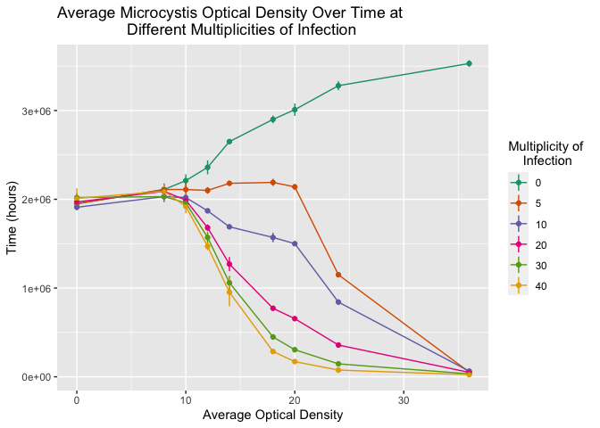
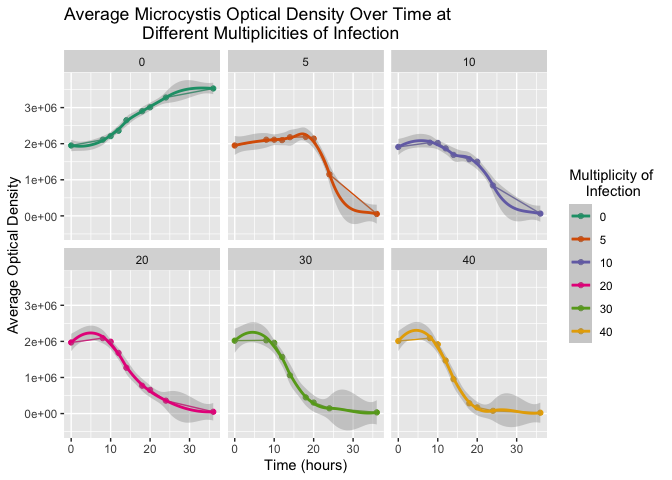

# Timeseries of Microcystis Lysed by a Virus Over a 36-hour Period
Eva Belevska

## Time series of Microcystis Lysed by a Virus Over a 36-hour Period

To begin this data analysis, the data was loaded with the following
code:

``` r
library(tidyverse)
library(readr)
library(ggplot2)

#The following code reads the csv file and loads the data frame. 
cell_density <- read_csv("data/cell_density.csv")
view(cell_density)
```

Many researchers have long asked why certain algal blooms happen at
certain places. The plot generated below shows the cyanobacteria
*Microcystis’s* average optical density after they were lysed by a virus
over a period of 36 hours. The amount of *Microcystis* that accumulates
isn’t only based on time and the amount of phosphate and nitrogen
available - it is also dependent on the presence of removal mechanisms
(@Wilhelm2020). In this case the removal mechanism is the virus, which
is lysing and killing the bacterial cells. The graph shows that the
optical density of the cyanobacteria decreases with the time that
passes- as the virus is killing and lysing the bacterial cells. The
inflection points for this data were generated with the following:

``` r
#The following code finds the derivatives of the data.
CD_derivative <- cell_density |>
  mutate(derivative = c(NA, diff(Mean) / diff(Time)))
#The previously calculated derivatives are then used to find the inflection points.
inflection_points <- CD_derivative |>
  filter(derivative == 0 | (derivative * lag(derivative)) < 0)
view(inflection_points)

glimpse(inflection_points)
```

    Rows: 11
    Columns: 5
    $ Time               <dbl> 10, 14, 20, 8, 10, 8, 10, 8, 10, 8, 10
    $ VLPMOI             <dbl> 5, 5, 5, 10, 10, 20, 20, 30, 30, 40, 40
    $ Mean               <dbl> 2110000, 2180000, 2140000, 2030000, 2020000, 209000…
    $ `Cell Density STD` <dbl> 70400, 3320, 32600, 61400, 30400, 38900, 48400, 507…
    $ derivative         <dbl> 0, 40000, -25000, 15000, -5000, 15000, -50000, 1250…

The inflection points show that the OD of the bacteria did not have an
inflection point when there was a 0 rate of infection. This is because
in this case there were no viruses in that sample to kill the
cyanobacteria; therefore, it kept growing at a steady rate. However, for
the other samples there seemed to be multiple inflection points. These
points signify the times where the rate of optical density changed due
to the virus lysing the cells. This shows that the more lysing that
occurs, the less chance there is for a biofilm to form (@Wilhelm2020).
The bacteria was also tested with differing rates of infection. This
showed that the higher the rate of infection, the smaller the average
optical density was.

The following code was used to generate a graph with the data:

``` r
#A plot was created using the data frame that was previously loaded.
cell_density_graph_3 <- ggplot(data = cell_density,
  mapping = aes(x = Time, y = Mean, color = factor(VLPMOI)))+
#Points were added and a line was used to connect the points on the graph.
  geom_point()+
  geom_line()+
#The following adds labels to the graph. 
  labs(
    x = "Average Optical Density", 
    y = "Time (hours)", 
    title = "Average Microcystis Optical Density Over Time at 
                Different Multiplicities of Infection", 
    color = "Multiplicity of 
    Infection"
  )+
#Error bars were added to the graph. 
  geom_pointrange(aes(ymin= Mean - `Cell Density STD`, ymax = Mean + `Cell Density STD`), size = 0.1, position = position_dodge(width = 0))+
#A color brewer palette was used to accomodate colorblind people. 
  scale_color_brewer(palette = "Dark2")
  
print(cell_density_graph_3)
```



A graph of the different infection rates was generated as well, clearly
showing the difference between each one using loess to smooth the data:

``` r
#A plot was created using the data frame that was previously loaded. 
cell_density_graph <- ggplot(data = cell_density,
  mapping = aes(x = Time, y = Mean, color = factor(VLPMOI))) +
#Points were added and a line was used to connect the points on the graph. 
  geom_line()+
  geom_point()+
#The following adds labels to the graph. 
    labs(
    x = "Time (hours)", 
    y = "Average Optical Density", 
    title = "Average Microcystis Optical Density Over Time at 
                Different Multiplicities of Infection", 
    color = "Multiplicity of 
    Infection")+
#This creates a graph for each multiplicity of infection.
  facet_wrap(~factor(VLPMOI))+
#This smooths the data. 
  geom_smooth(method = loess)+
#It is important to use a color scheme that takes colorblind people into account, so the a color brewer palette was utilized. 
  scale_color_brewer(palette = "Dark2")

print(cell_density_graph)
```

    `geom_smooth()` using formula = 'y ~ x'



## References:

Wilhelm, S. W., Bullerjahn, G. S., & McKay, M. L. (2020). The
Complicated and Confusing Ecology of Microcystis Blooms.
https://www.bgsu.edu/content/dam/BGSU/great-lakes-center/Wilhelm-2020.pdf
