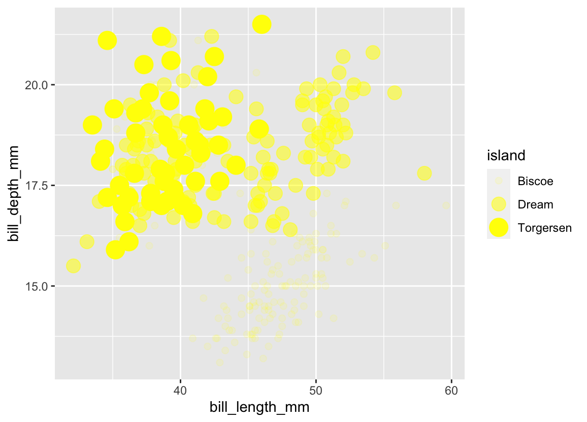
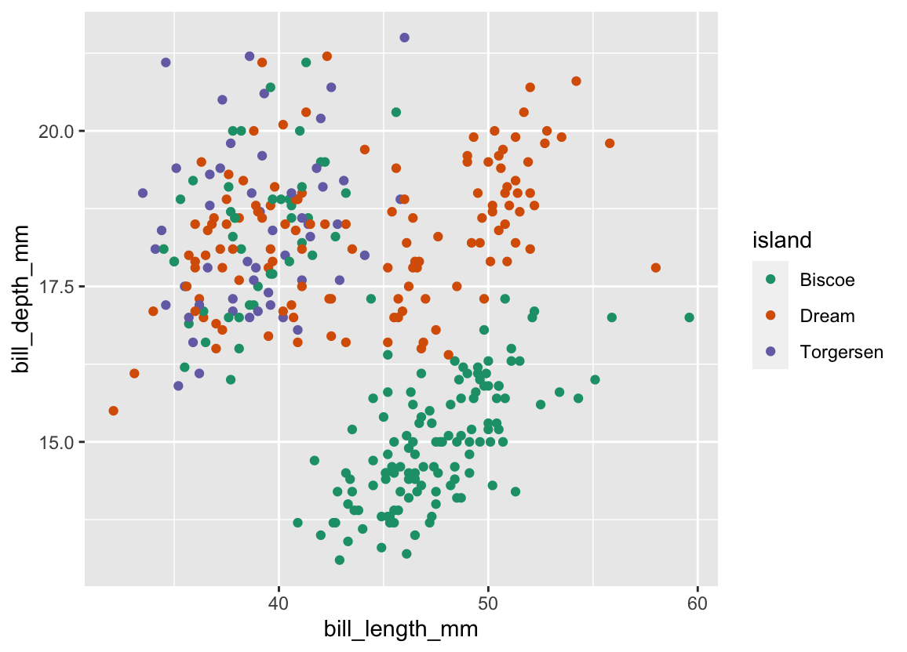

# Bad Graph
Eva Belevska

# Homework 7

## Bad Plot



``` r
library(tidyverse)
library(palmerpenguins)

ggplot(data = penguins) +
  geom_point(
    mapping = aes(x = bill_length_mm, y = bill_depth_mm, size = island, alpha = island), data = penguins, 
    color = "yellow"
  )
```


This is a bad plot because the color chosen for the points is hard to
look at. According to Wilkes a good plot will not have “junk”. This plot
is somewhat filled with “junk” because the size and opaqueness of the
dots both represent the island type. Additionally,the opacity of the
dots also makes it hard to read because it is hard to tell which points
are which shade of yellow because they all seem to clump together and
overlap. There is no way to tell where one dot ends and another begins.
Furthermore, Wilkes states that how bright an object looks depends on
how bright its surroundings are. this could also be applied to this
graph because if a really bright dot is which, represents the Torgersen
island, is close to the dot representing Dream island, it could make the
duller dot seem less opaque and it could be mistaken for Biscoe island.
The intent of this plot was to compare the bill length against the bill
depth on penguins, and to also compare how this varies between the three
islands. However, it fails to do present this data in a way that is easy
to read.

## Fixed Plot



``` r
ggplot(penguins, aes(x=bill_length_mm, y=bill_depth_mm, color=island)) +
geom_point(size=1.5) +
scale_color_brewer(palette = "Dark2")
```


This plot is much easier to read than the previous plot. The islands are
only represented by one thing (different colors) rather than two
(opacity and size). Furthermore, the colors that were used are not as
bright as the yellow in the previous graph. Additionally, Healy mentions
that colorblind people may not be able to read some graphs, so the color
brewer palette “Dark2” was used to accommodate for this.
