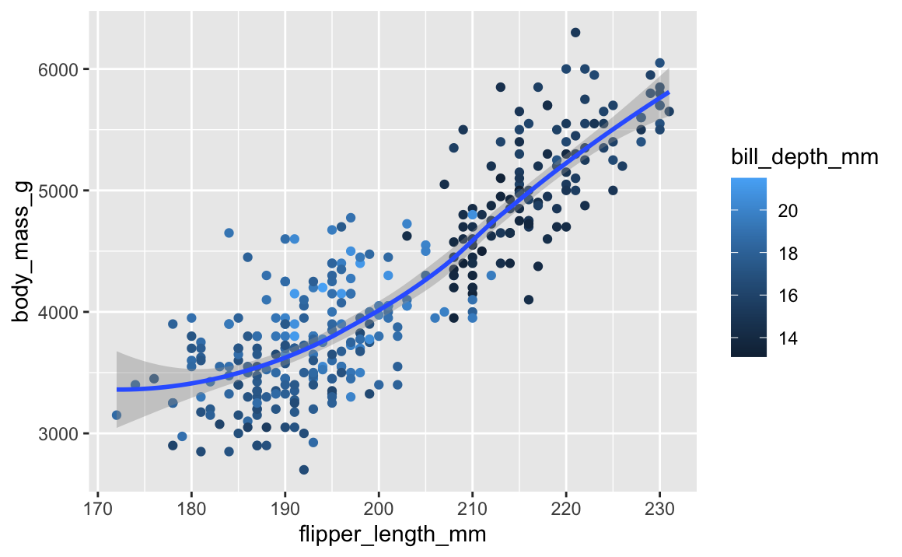

# Homework 3

Eva Belevska

# Creating and naming variables

**Create a variable called x and use it to store the result of the calculation (3\*(4+2).**

``` r
x <- (3*(4+2))
```

**Calculate the product of x (from the above question) times π.**

``` r
x * pi
```

```         
[1] 56.54867
```

**Use the getwd() function to show your current working directory. Is that a good working directory, and what program do you think set it that way?**

``` r
getwd()
```

```         
[1] "/Users/eva/Desktop/Semester 5/MICRO475/HOMEWORK"
```

I think that this would be a good working directory because this directory is specifically for this class, which will keep my files organized if I have other projects I am using R studio for. I think the progeam that sets it that way is R.

# Vectors

**Use the c() function to create a vector of numbers.**

``` r
c(333, 123, 546)
```

```         
[1] 333 123 546
```

**Use the c() function to create a vector of characters.**

``` r
c("apples", "bananas" , "oranges")
```

```         
[1] "apples"  "bananas" "oranges"
```

**Use the : implicit function to create a vector of integers from 1 to 10.**

``` r
1:10
```

```         
 [1]  1  2  3  4  5  6  7  8  9 10
```

**Remove (delete) every variable in your workspace.**

``` r
rm(list = ls()) 
```

**Explain why the following code returns what it does. Also address whether you think this was a good decision on the part of the designers of R?**

``` r
v1 <- 1:3
v2 <- c(1:4)
v1 + v2
```

```         
[1] 2 4 6 5
```

The code is adding the last number in the first vector to the first number in the second vector. I think that it was a good idea because while it could mess you up in this specific example, this same function allows you to add one number to a vector of numbers. For example, if you wanted to add the number 1 to a list of numbers, you could make the list of numbers one vector, and the individual number another vector.

**Explain what the following code does. It may be helpful to reference the answer to the previous question:**

``` r
c(1, 5, 9) + 3
```

```         
[1]  4  8 12
```

The code is adding 3 to each number in vector.

# Graphics

**Load the tidyverse package. NOTE: Be sure to use the chunk option message=FALSE to suppress the messages that tidyverse prints when loaded. These messages are useful in the**

``` r
library(tidyverse)
library(palmerpenguins)
```

**Recreate the visualization of body_mass_g to flipper_length_mm, from the penguins data set, that is shown in question 8 of section 2.2.5 of R4DS.**

``` r
ggplot(data = penguins, 
       mapping = aes(x=flipper_length_mm, y=body_mass_g, color = bill_depth_mm)) +
  geom_point(aes(color = bill_depth_mm)) +
  geom_smooth(method="loess")
```




**Explain why each aesthetic is mapped at the level that it is (i.e., at the global level, in the ggplot() function call, or at the geom level, in the geom_XXX() function call). Note: A lot of different options will work, but some options are clearly better than others.**

The reason as to why the aesthetics are plotted in the global level is because we want them to apply to the rest of the chart. Everything in the global level is passed down to the other levels as well. Therefore, that is why we want to establish what is on the x and y axis and what we want the color to represent. However, we then map the color aesthetic at the geom_point because we want to plot it at the local level. When plotting things at the local level, you are taking things that are plotted at the global level and adding to them.
