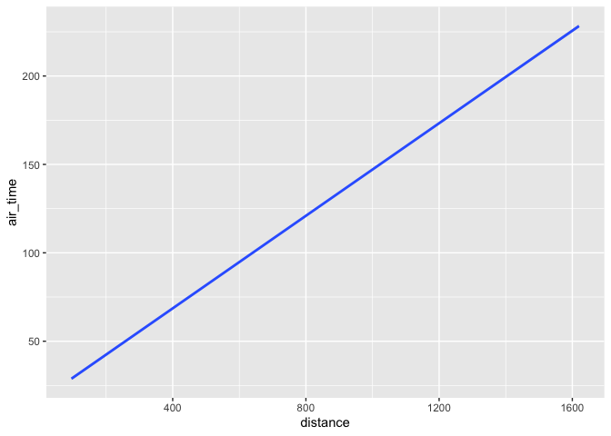

# Hmk_04 template: Data frames and data wrangling

Please read the entire [R for Data
Science](https://r4ds.hadley.nz/data-transform) before you do this
homework.

This homework relies on the `nycflights13` package, which contains
several data frames, including `airlines`, `airports`, `flights`,
`planes`, and `weather`. Loading `nycflights13`
(`library(nycflights13)`) puts all of these data frames on the search
path.

## Installing data packages

Remember that any package needs to be installed only once (per version
of R), but needs to be loaded every time we start a new R session.

To install `nyclflights13`, use `install.packages("nycflights13")` (with
quotation marks). To load it, use `library(nycflights13)`.

``` r
library(tidyverse)
library(nycflights13)
```

# Question 1: filtering

Make a plot of air time as a function of distance (air time on the y
axis, distance on the x axis) for all flights that meet the following
criteria:

- originate from LaGuardia airport (“LGA”)

- departed on the 16th of the month

- have a flight distance of less than 2000

``` r
flights_filtered <- flights |>
  filter (origin == "LGA", day == 16, distance < 2000)

flights_filtered_graph <- ggplot(data = flights_filtered, 
       mapping = aes(x = distance, y = air_time)) +
  geom_smooth(method = "lm")

print(flights_filtered_graph)
```



# Question 2: dealing with NAs

Make a data frame of all of the rows of `flights` that have values for
*both* `arr_time` and `dep_time` - that is, neither of those values are
`NA`.

``` r
flights_Q2 <- flights |>
  filter(!is.na(arr_time & dep_time))

view(flights_Q2)
```

## filtering NAs

`ggplot()` will automatically remove NA values from the plot, as you may
have seen in question 1, but it emits a warning message about that. Of
course you could silence the warning message using [chunk
options](https://bookdown.org/yihui/rmarkdown-cookbook/chunk-options.html),
but how could you prevent them from appearing in the first place?

I would prevent them from appearing in the first place by using the code
I used in the above problem. When I used the code there was no error
message and there were no NAs in the plot. Or you could use min (…,
na.rm = TRUE). Another way would be to use the function
filter(!is.na()).

# Question 3: adding columns

Create a data frame of average flight speeds, based on `air_time` and
`distance`. Make either a histogram or a density plot of the data. If
you like, you may break the data out (e.g. by airline, or some other
variable) in a way that you think makes sense.

``` r
speeds_Q3 <- flights |>
  mutate(speed = distance / air_time) |>
  group_by(month) |>
  mutate(avg_flight_speed = mean(speed, na.rm = TRUE))

graph_Q3 <- ggplot (data = speeds_Q3, mapping = aes(avg_flight_speed)) + geom_density()
print(graph_Q3)
```


